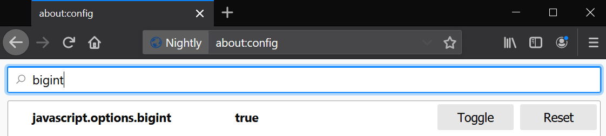

# Full chain exploit for CVE-2019-11708 & CVE-2019-9810

This is a full browser compromise exploit chain (CVE-2019-11708 & CVE-2019-9810) targeting Firefox on Windows 64-bit. It uses CVE-2019-9810 for getting code execution in both the content process as well as the parent process and CVE-2019-11708 to trick the parent process into browsing to an arbitrary URL.


I have covered CVE-2019-9810's root-cause and exploitation in the past in [A journey into IonMonkey: root-causing CVE-2019-9810](https://doar-e.github.io/blog/2019/06/17/a-journey-into-ionmonkey-root-causing-cve-2019-9810/) article and in the associated [github repository](https://github.com/0vercl0k/CVE-2019-9810).

CVE-2019-11708 has been fixed by the bulletin [mfsa2019-19](https://www.mozilla.org/en-US/security/advisories/mfsa2019-19/) and was assigned *Bug 1559858* in the Mozilla bug tracker. Here is the summary of the issue:

```text
Insufficient vetting of parameters passed with the Prompt:Open IPC message between child
and parent processes can result in the non-sandboxed parent process opening web content
chosen by a compromised child process. When combined with additional vulnerabilities this
could result in executing arbitrary code on the user's computer.
```

You can find the commit addressing the issue here: [Clean up prompt open calls in Prompter.jsm](https://phabricator.services.mozilla.com/D35371).

## Overview of the issue

A full-write up of the issue as well as the techniques used in the exploit will be described in an upcoming article on [doar-e.github.io](https://doar-e.github.io/).

## Organization

The [exploit](https://github.com/0vercl0k/CVE-2019-11708/blob/master/cthulhu.js) has been tested against Windows 19H2 64-bit and it targets a custom build of Firefox so don't be surprised if a bit of work is required to make it work elsewhere :). However, if you just feel like running the exploit without compiling anything, I prepared a packaged browser that I uploaded in [release/firefox-68.0a1.en-US.win64.7z](https://github.com/0vercl0k/CVE-2019-11708/releases/download/1/firefox-68.0a1.en-US.win64.7z). It also includes the `js.exe` shell as well as private symbol information for `js.exe`, `firefox.exe` and `xul.dll`.

The exploit assumes that the support for [BigInt](https://developer.mozilla.org/en-US/docs/Web/JavaScript/Reference/Global_Objects/BigInt) is turned on in Firefox which you can do by toggling `javascript.options.bigint` in `about:config`.



The exploitation process uses a data corruption to gain privileged JS execution aka **God Mode** (which is basically an implementation of [a technique used in Pwn2Own2014](https://bugzilla.mozilla.org/show_bug.cgi?id=982974) by Jüri Aedla) which is very different (and much more convenient) from the way I had exploited [CVE-2019-9810](https://github.com/0vercl0k/CVE-2019-9810). This means that there is no control-flow getting hijacked during the exploit chain.

1. The exploit uses CVE-2019-9810 to perform the **God Mode** data corruption and refreshes the current page.
2. Once it can execute privileged JS, it finds the current frame [message manager](https://developer.mozilla.org/en-US/docs/Mozilla/Firefox/Multiprocess_Firefox/Message_Manager/Message_manager_overview) and triggers CVE-2019-11708.
3. Now that the parent process visited our arbitrary page, we exploit CVE-2019-9810 again  and get privileged JS execution there as well.
4. At this point the entire browser (sandbox included) is compromised. The first stage is to download and drop a local payload dubbed **slimeshady.exe** that you can find in [payload/](https://github.com/0vercl0k/CVE-2019-11708/blob/master/payload) which draws a bunch of animated **Slime shady** sprites on the desktop with GDI. The exploit also drops and injects a [frame script](https://developer.mozilla.org/en-US/docs/Mozilla/Firefox/Multiprocess_Firefox/Message_Manager/Frame_script_loading_and_lifetime) (privileged JS) in every tab to backdoor the whole navigation (already created tabs as well as newly created ones). The tab backdooring is similar to [CVE-2019-9810/payload](https://github.com/0vercl0k/CVE-2019-9810/tree/master/payload) in effect (arbitrary JS injected in every tabs), but this time it is implemented using a Firefox feature (`Services.mm.loadFrameScript`) instead of [hacky and dirty hooks](https://github.com/0vercl0k/CVE-2019-9810/blob/master/payload/src/ReflectiveDll.cc#L326).

In reality, there are a bunch of more subtle details that are not described by the above and so if you are interested you are invited to go find the truth and read the sources / future article :).

UPDATE June 13 2020: According to [@rtfingc](https://github.com/rtfingc) / [Issue #1](https://github.com/0vercl0k/CVE-2019-11708/issues/1), Mozilla has mitigated the data corruption presented in this exploit with a commit from the 10th Feb 2020: [Bug 1602485](https://hg.mozilla.org/mozilla-central/rev/ef01a12520ae39f25f6cfa3972c85e2b1deb1dcb).

## Building the payload

To build the payload, you just have to run `nmake` from a VS 2017 x64 prompt.

```text
CVE-2019-11708\payload>nmake

Microsoft (R) Program Maintenance Utility Version 14.16.27034.0
Copyright (C) Microsoft Corporation.  All rights reserved.

        taskkill /f /im payload.exe
ERROR: The process "payload.exe" not found.
        if not exist .\bin mkdir bin
        python src\genheaders.py sprites
        cl /O1 /nologo /ZI /W3 /D_AMD64_ /DWIN_X64 /sdl /Febin\payload.exe src\payload.cc /link /nologo /debug:full user32.lib
payload.cc
        del *.obj *.pdb *.idb
        if exist .\bin del bin\*.exp bin\*.ilk bin\*.lib
        start .\bin\payload.exe
```

This creates a `payload.exe` / `payload.pdb` file inside the `payload\bin` directory.

## Building Firefox

I wrote this exploit against a local Windows build synchronized to the following revision id: [2abb636ad481768b7c88619080cf224b2c266b2d](https://hg.mozilla.org/mozilla-central/rev/2abb636ad481768b7c88619080cf224b2c266b2d) (if you don't feel like building it yourself, I've uploaded my build here: [release/firefox-68.0a1.en-US.win64.7z](https://github.com/0vercl0k/CVE-2019-11708/releases/download/1/firefox-68.0a1.en-US.win64.7z)):

```text
$ hg --debug id -i
2abb636ad481768b7c88619080cf224b2c266b2d
```

And I have used the following `mozconfig` file:

```text
. "$topsrcdir/browser/config/mozconfigs/win64/common-win64"

ac_add_options --disable-crashreporter
ac_add_options --enable-debug-symbols

. "$topsrcdir/build/mozconfig.clang-cl"
. "$topsrcdir/build/mozconfig.lld-link"

# Use the clang version in .mozbuild
CLANG_LIB_DIR="$(cd ~/.mozbuild/clang/lib/clang/*/lib/windows && pwd)"
export LIB=$LIB:$CLANG_LIB_DIR

ac_add_options --enable-js-shell
ac_add_options --enable-jitspew
mk_add_options MOZ_OBJDIR=@TOPSRCDIR@/obj-ff64
```
