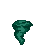

# Slime Shady

The payload uses GDI to spawn a few dozens layered / most on top / transparent windows where slimes sprites are animated. It draws on the windows using [Device Independent Bitmaps](https://docs.microsoft.com/en-us/windows/win32/gdi/device-independent-bitmaps). DIBs are basically a palette of RGB colors as well as an array of 1 byte pixels.





There is a master window that receives a message `WM_TIMER` at regular interval and that invalidates every windows' client area. This triggers `WM_PAINT` messages so that every window can update their window.

The [genheaders.py](https://github.com/0vercl0k/CVE-2019-11708/blob/master/payload/src/genheaders.py) Python script preprocesses the [sprites](https://github.com/0vercl0k/CVE-2019-11708/tree/master/payload/sprites) directory and generates a valid compressed set of DIBs that the program will draw using [StretchDIBits](https://docs.microsoft.com/en-us/windows/win32/api/wingdi/nf-wingdi-stretchdibits).

Thanks to [kaze](http://fat.malcat.fr/) for [inspiration](http://fat.malcat.fr/PayloadBaboons.html) and his blogposts regarding GDI.

## Building the payload

To build the payload, you just have to run `nmake` from a VS 2017 x64 prompt.

```text
CVE-2019-11708\payload>nmake

Microsoft (R) Program Maintenance Utility Version 14.16.27034.0
Copyright (C) Microsoft Corporation.  All rights reserved.

        taskkill /f /im payload.exe
ERROR: The process "payload.exe" not found.
        if not exist .\bin mkdir bin
        python src\genheaders.py sprites
        cl /O1 /nologo /ZI /W3 /D_AMD64_ /DWIN_X64 /sdl /Febin\payload.exe src\payload.cc /link /nologo /debug:full user32.lib
payload.cc
        del *.obj *.pdb *.idb
        if exist .\bin del bin\*.exp bin\*.ilk bin\*.lib
        start .\bin\payload.exe
```

This creates a `payload.exe` / `payload.pdb` file inside the `payload\bin` directory.
